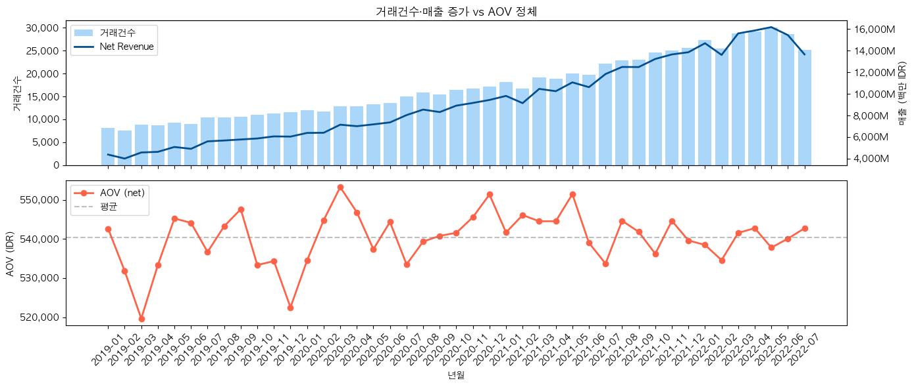
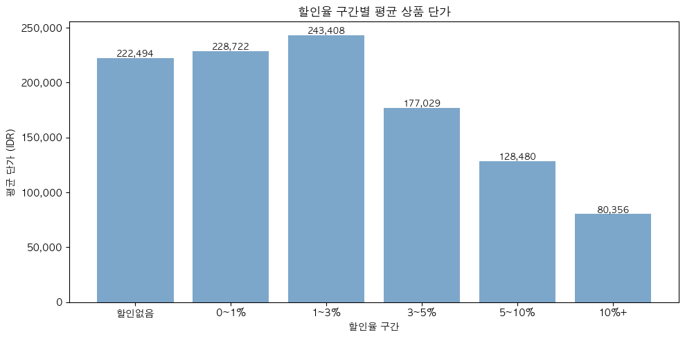
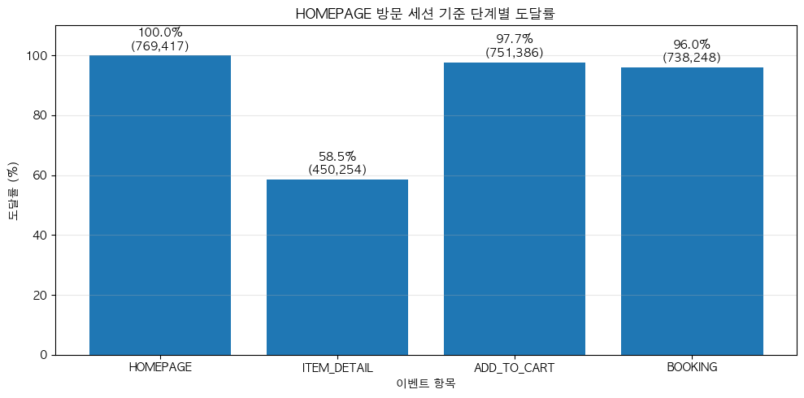

# 매출은 성장하는데 왜 AOV는 오르지 않는가
### 매출 성장 속 AOV 개선 가능성 탐색과 실행 전략 도출

---

## 프로젝트 개요

본 프로젝트는 Kaggle의 이커머스 앱/웹 데이터를 활용해  
매출이 증가하는 상황에서 평균 주문 금액(AOV) 개선을 통해 추가적인 매출 성장 가능성을 탐색하고,  
데이터 기반 개선 전략을 도출한 데이터 분석 포트폴리오입니다.

- **분석 목표** : AOV 정체 원인을 고객 구성, 프로모션 구조, 상품 탐색 행동 관점에서 검토하고  
  실행 가능한 전략과 성과 측정 기준(KPI)까지 연결하는 것을 목표로 했습니다.

---

## 데이터셋

- **데이터 설명**: 인도네시아 전자상거래 앱의 거래 활동, 상품 주문 정보, 고객 정보, 앱/웹 내 행동 로그를 포함한 데이터.
- **데이터 선택 이유** : 해당 데이터는 거래 데이터, 고객 속성, 상품 카테고리, 프로모션 정보, 앱/웹 행동 로그를 함께 포함하고 있어  
AOV를 단순 매출 지표가 아니라 **고객 세그먼트, 상품 구성, 구매 행동 흐름 관점에서 복합적으로 분석**할 수 있다고 판단.

| 테이블 | 설명 | 주요 컬럼 |
|--------|------|-----------|
| customer | 고객 정보 | customer_id, birthdate, gender |
| product | 상품 정보 | id, masterCategory, subCategory |
| transactions | 거래 내역 | booking_id, customer_id, total_amount, promo_amount |
| click_stream | 행동 로그 | session_id, event_name, event_time, traffic_source |

> 출처 : [Kaggle E-commerce App Transactional Dataset](https://www.kaggle.com/datasets/bytadit/transactional-ecommerce)  
> 분석 기간 : 2019 ~ 2022 (4개년)

---

## 문제 정의 
  
- 매출과 거래건수는 지속적으로 증가했지만 AOV는 일정 범위에 머무르는 패턴 확인.
- AOV가 상승하지 않는 원인을 검토하고, **추가적인 매출 성장 가능성으로 활용할 수 있는지, 개선 지점을 탐색**.
  > 거래건수는 성장, AOV는 정체
  

---

## 분석 목적

- 거래건수 증가에도 AOV가 장기적으로 상승하지 않는 원인 후보를 탐색.
- 고객 구성, 상품 카테고리, 프로모션, 상품 탐색 행동 관점에서 AOV 개선 가능성 확인.
- 분석 결과를 바탕으로 A/B 테스트와 KPI 측정 기준까지 연결.

---

## 분석 구조

- AOV는 고객 구성, 프로모션, 구매 행동 흐름의 영향을 받을 수 있다고 보고  
아래 3가지 관점으로 원인 후보를 검증했습니다.

1. **가설 검증**
   매출은 `거래건수 × AOV`로 구성되므로, 거래건수 증가에도 AOV가 오르지 않는 원인을  
   고객 믹스, 프로모션 구조, 고가 구매층 변화 관점에서 검토했습니다.
   - **신규고객 증가** → 기각 : 신규고객 비율 오히려 감소
   - **프로모션 구조 문제** → 부분 채택 : 고율 할인 구간에 저가 상품 집중
   - **고가 구매층 이탈** → 기각 : 고가 구매 비율 약 25%로 일정 

2. **세그먼트 분석**  
   고객 기본 속성인 연령대 × 성별 기준으로는 AOV 차이가 크지 않아,  
   구매 상품과 프로모션 구조의 영향을 함께 보기 위해 상품 카테고리를 추가하여 분석.

3. **상품 탐색 이벤트 도달률 분석**  
   세그먼트분석에서 명확한 원인이 확인되지 않아,  
   구매 과정에서 AOV 개선 여지가 있는지 확인하기 위해 상품 탐색 이벤트 도달률을 분석.  
   > 순차 퍼널은 데이터 한계로 적용이 어려워, 세션 내 이벤트 포함 여부 기준으로 도달률을 측정.

---

## 핵심 인사이트

- **세그먼트별 AOV 차이는 크지 않지만, 실행 타겟은 구분 가능**  
  거래건수 중심 핵심 세그먼트와 고구매금액 잠재 세그먼트를 전략 대상으로 분류
- **고율 할인(3%+) 구간에 저가 상품 집중** — 프로모션 구조가 AOV 상승을 제한할 가능성
   > 3% 이상 구간부터 평균 단가 급감 — 고율 할인이 저가 상품에 집중된 구조

- **HOMEPAGE 포함 세션 중 ITEM_DETAIL 미진입률 41%** — 상세페이지 진입 구간 개선 여지 확인  
  ITEM_DETAIL 진입 세션에서 AOV는 3%, 구매 전환율(CVR)은 2%p 더 높게 나타남
   > HOMEPAGE 포함 세션 중 ITEM_DETAIL 미진입 41%

---

## 전략 제안 요약

가설 검증, 세그먼트 분석, 상품 탐색 이벤트 도달률 분석 결과를 바탕으로  
AOV 개선 가능성이 있는 실행 과제를 단기 / 중기 / 장기 우선순위로 정리했습니다.

### 단기(0-1개월) : 상품 탐색 및 프로모션 구조 개선
- **홈페이지 UX 개선** : 상세페이지 진입률을 높이기 위해 상품 카드 행동 유도 버튼(CTA), 퀵뷰, 추천 영역 개선 제안
   → **A/B 테스트** : 기존 홈/상품 리스트 vs 상세페이지 진입 유도 UI 적용 화면 비교  
- **프로모션 구조 개선** : 고율 할인 구간에 저가 상품이 집중되어 있어, 고율 할인 비중 축소 및 고가 상품 소폭 할인 테스트 제안
    → **A/B 테스트** : 기존 할인 정책 vs 고가 상품 1~3% 소폭 할인 정책 비교  

### 중기(1개월-3개월) : 핵심 세그먼트 중심 AOV 개선
- **핵심 세그먼트 집중 공략**: 10~30대 여성 Apparel / Accessories / Footwear의 거래건수 비중이 높아 우선 실험 대상으로 설정
- **번들 / 업셀 도입**: Apparel 구매 고객에게 Accessories 번들 추천을 적용해 AOV 개선 가능성 검증

### 장기(3개월 이상) : 잠재 세그먼트 및 재구매 고객 고도화
- **잠재 세그먼트 유입 확대**: 50대 여성 Footwear는 표본은 적지만 높은 구매금액 패턴이 확인되어 추가 데이터 확보 후 검증 필요
- **재구매 고객 번들 추천 고도화**: 5회 이상 재구매 고객 대상 맞춤 번들 추천으로 AOV와 고객 생애 가치(LTV) 개선 가능성 검토

### 성과 측정 기준
| KPI | 목적 |
|---|---|
| Net AOV | 객단가 개선 여부 |
| CVR | 전환율 하락 여부 |
| ITEM_DETAIL 진입률 | 상세페이지 진입 개선 효과 |
| 주문건수 | 주문 감소 여부 |
| 고율 할인 거래 비중 | 프로모션 구조 개선 여부 |
| 매출 | 최종 성과 확인 |
| 재구매율 / 리텐션 | 번들·업셀 전략 효과 확인 |

---

## 분석 한계

- 캐글 시뮬레이션 데이터로 실제 비즈니스 패턴과 차이가 있을 수 있음
- AOV 월별 급등락 구간을 별도로 확인했으나,  
   시뮬레이션 데이터 특성상 특정 변동을 고객군·상품군·프로모션 요인으로 명확히 설명하기 어려움.
- click_stream의 session_id가 실제 접속 세션 단위와 상이해 순차 퍼널 적용 불가
  - 30분 기준 세션 재정의 시도했으나 세션당 이벤트 중앙값 1건으로 한계 확인
  - 세션 내 이벤트 포함 여부 기준으로 도달률 측정으로 전환
- 프로모션 비용 데이터 없어 ROI 직접 측정 불가
- 50대 여성 세그먼트 등 일부 표본 부족으로 통계적 신뢰도 제한

---

## 사용 기술

---

## 대시보드

분석 결과를 시각화한 Tableau 대시보드를 아래 링크에서 확인할 수 있습니다.

🔗 [Tableau Public 바로가기](https://public.tableau.com/views/ecommerce-aov-analysis-dashboard/1?:language=ko-KR&publish=yes&:sid=&:redirect=auth&:display_count=n&:origin=viz_share_link)

**구성** : 비즈니스 현황 / 가설 검증 / 세그먼트 분석 / 이벤트 도달률 분석 / KPI 모니터링
